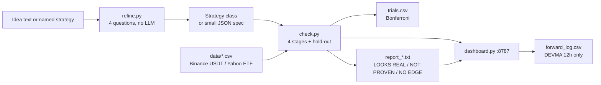
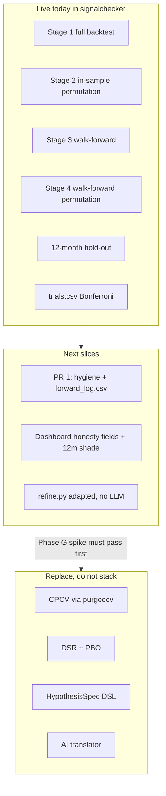

# Unified Trading-Validation Project — Design & Roadmap

| Field | Value |
|---|---|
| Title | One project from algoideas + signalchecker + grok-trading-test |
| Author | Grok (for Bart) |
| Date | 2026-08-17 |
| Status | Draft |
| Home repo | `C:\ClaudeOS\Projects\signalchecker` → github.com/bartholomewtj/signal-checker |
| Audience | Bart (implement one slice at a time) and a later agent (implement without re-reading the three folders) |

Absorbed 2026-08-17: `algoideas/pipeline-spec.md` is now `docs/algoideas-v4-spec.md`. The grok-trading-test panel is archived at `docs/archive/grok-panel.html`; Lightweight Charts is vendored. `refine.py` lives here. The `algoideas` and `grok-trading-test` folders are deleted after this lands.

---

## What this project does, and how to run it

You give it a trading rule. It tells you whether the rule's backtest looks real or looks like luck. Most ideas fail. That is the product working.

There is **one** project. The working code is `signalchecker`. The old
`algoideas` spec is `docs/algoideas-v4-spec.md`. The grok-trading-test
panel is archived under `docs/archive/`. Those folders no longer exist.

### Run it today

From `C:\ClaudeOS\Projects\signalchecker`. Plain `python` on this machine lacks pandas. Use:

```
uv run --with-requirements requirements.txt python data.py
uv run --with-requirements requirements.txt python check.py --strategy devma --timeframe 12h
uv run --with pytest --with-requirements requirements.txt pytest -q tests
```

Dashboard (needs the full interpreter path):

```
"C:\Users\barth\AppData\Local\Python\pythoncore-3.14-64\python.exe" dashboard.py
```

Opens http://localhost:8787.

Quick check (~1 minute, fewer shuffles):

```
uv run --with-requirements requirements.txt python check.py --strategy diamond_hands --timeframe 1d --quick
```

One-shot hold-out (DEVMA 12h has already been looked at). `run_holdout` must refuse a second look for any `(strategy, timeframe)` that already has a `mode=holdout` row, unless `--i-know-this-burns-the-holdout` is passed. Do not run this again for DEVMA.

### What a run produces

- Screen output and `report_<strategy>_<timeframe>.txt`
- One new row in `trials.csv`
- A verdict: **LOOKS REAL**, **NOT PROVEN**, or **NO EDGE**

A LOOKS REAL at the raw p < 0.05 bar that fails the Bonferroni-corrected bar is labelled provisional. See "Current verdicts" below.

---

## Overview

Three overlapping slices exist:

| Folder | What it is | Git? |
|---|---|---|
| `Projects\signalchecker` | Working honesty pipeline. 8 strategies, permutation + walk-forward, 12-month hold-out, `trials.csv`, dashboard, tests. | Yes. github.com/bartholomewtj/signal-checker. `main` at `79cd89b`. |
| `Projects\algoideas` | Spec only. `pipeline-spec.md` v4: six-stage rule tester with Combinatorial Purged Cross-Validation (CPCV), Deflated Sharpe Ratio (DSR), Probability of Backtest Overfitting (PBO), SQLite ledger, AI translator. | No. Do not `git init`. |
| `Projects\grok-trading-test` | Working prototype. VectorBT backtester, 70/30 in-sample/holdout, deterministic idea→questions→spec (`refine.py`), Lightweight Charts panel with zoom-and-recalculate. Ports the same 8 ideas. No CPCV, no DSR, no PBO, no trial ledger. | No. Do not `git init`. |

They all answer "does this rule have an edge?" with different honesty levels and different engines. That is three backtests of the same ideas. This document picks **one home, one pipeline, one honesty stack, one roadmap**.

**Proposal:** keep `signalchecker` as the only living project. Absorb two pieces from grok-trading-test (the zoom panel behaviour, and the no-LLM refine questions). Treat algoideas v4 as the *later* honesty upgrade, not a rewrite. Do the DEVMA 12h forward-test first, before any engine or statistics change.

---

## Background & Motivation

### Why three slices exist

- **algoideas** is the intended end-state: a machine that takes a vague idea and returns ACCEPT / REJECT after leak-free cross-validation and deflation for every trial ever run. It has no code.
- **signalchecker** was built to judge eight TradingView ports. It grew the honesty features algoideas wanted in simpler form: a reserved hold-out, a trial ledger, Bonferroni correction, short funding, a lookahead tripwire. That work landed in PRs #4 and #5 (2026-08-07).
- **grok-trading-test** is a later vertical slice that adopted VectorBT, added a visual IS/OOS panel, and a deterministic refine path. It does not edit signalchecker. `CONTEXT.md` does not mention it, so it is easy to ignore.

### Pain points

- Two engines (`backtesting.py` vs VectorBT) will not print the same P&L for the same idea. Keeping both means every number has an asterisk.
- Two dashboards (`dashboard.py:8787` vs `panel.py:8790`) both chart the same CSVs.
- Two honesty stories. signalchecker: permutation p-values + walk-forward + Bonferroni. algoideas: CPCV + DSR + PBO. Running both forever double-penalises every idea and delays the only live task (DEVMA forward-test).
- `CONTEXT.md` routes "Signal honesty / backtests" to signalchecker and "Trading-idea validation spec" to algoideas. That split is now wrong.

### Current verdicts (do not "fix")

Source of truth: `ANALYSIS.md` section "Reruns under the honest rules", `trials.csv`, `holdout_devma_12h.txt`. Old `report.txt` / `report_diamond_hands.txt` predate the honest rules — ignore them.

| Combo | Honest verdict | Notes |
|---|---|---|
| **DEVMA 12h** | LOOKS REAL (4/4), **provisional** | Only survivor. p_is=0.0399, p_wf=0.0159. Both clear raw 0.05. Neither clears the final Bonferroni bar 0.05/5 = 0.0100. OOS +231.7% vs buy-and-hold +767.4%. |
| DEVMA 1d | NOT PROVEN (2/4) | Died under funding + trade-level PF + hold-out split. |
| Diamond Hands 4h | NOT PROVEN (3/4) | In-sample p=0.0075 (strong); walk-forward p=0.0558. Stage-2 PF 3.005 collapsed to OOS PF 1.065. Overfit fingerprint. |
| `combo` | documented negative | Merging Diamond Hands sweeps into DEVMA diluted the parent. Keep `--strategy combo`. Do not "fix". |

**DEVMA 12h hold-out (one look, already taken):** +7.2% return, trade-level PF 1.208, Sharpe 0.23, 30 trades, 2025-08-07 to 2026-08-06, against buy-and-hold −44.9%. Parameters from the last walk-forward fold: `{vol_ma: 20, vol_run: 8}`. **Do not re-tune DEVMA because of this number. Do not run `--holdout` for DEVMA again.**

Issue #1 on GitHub still says "DEVMA on 12h and 1d" and "long-only daily variant". That text predates the honest rerun. Implement #1 as **DEVMA 12h, direction both, pinned params `{vol_ma: 20, vol_run: 8}`**. That is the configuration that earned the verdict.

---

## Goals & Non-Goals

### Goals

- One home repo. One `check.py` path for a verdict. One ledger.
- DEVMA 12h forward-test ships first and is not blocked by a rewrite.
- A later agent can implement from this document alone.
- Honesty upgrades (CPCV, DSR, PBO) arrive as replacements, not as a second stack running forever.
- Fewest files, fewest dependencies, fewest config layers.

### Non-goals (this year, unless a later slice re-opens them)

- Machine learning, classifiers, triple-barrier labels.
- FX (yfinance FX bars are not real opens).
- Live order routing, broker APIs, Nautilus, freqtrade.
- A new GitHub repo. A rename of `signal-checker`.
- `git init` in `algoideas`, `grok-trading-test`, or `C:\ClaudeOS`.
- Re-earning the eight strategies under VectorBT.
- Building the algoideas HypothesisSpec DSL, parquet snapshots, or AI translator before the live honesty stack is replaced on purpose.
- Putting the 50/50 Diamond Hands 4h + DEVMA 1d blend on the dashboard. Both parents failed the honest rerun. The blend numbers in `ANALYSIS.md` are pre-honest.

---

## Key Decisions

Phase letters are used in one scheme only, everywhere in this document:

| Letter | Meaning |
|---|---|
| A | DEVMA 12h forward-test **and** the three data-hygiene rules it needs |
| B | Dashboard honesty fields |
| C | Panel UX into the dashboard |
| D | *(reserved — no extra hygiene phase; that work is in A)* |
| E | refine.py adaptation (no LLM) |
| F | Factory `adw_rerun.py` (optional) |
| G | Statistics spike (`purgedcv`, DSR, PBO). No verdict change. |
| H | One dated PR: CPCV+DSR+PBO become the required gate for *new* hypotheses; Bonferroni and required permutation retire |
| I | DSL + AI translator (last) |

No `purgedcv` before Phase G (spike script only). No `core/`, `schema/`, `config/`, or `trials.db` before Phase H. Do not change verdicts until Phase H.

### 1. Surviving project: `signalchecker`

**Why.** It is the only git repo. It already has the honesty machinery, the DEVMA result, `trials.csv`, the lookahead tripwire, and open issues #1 / #2 / #6. Fewest moving parts = keep the working pipeline and absorb two small pieces, rather than stand up algoideas from a spec or promote grok-trading-test (no CPCV, no ledger, no permutation, not a repo).

`algoideas` and `grok-trading-test` stay on disk as read-only archives. They are not tools you run for a verdict after this lands.

### 2. What moves, what is deleted, what is archived

| Item | Fate |
|---|---|
| `signalchecker/` entire tree | **Home.** Keep. All new work is a branch + PR here. |
| `signalchecker/strategies.py` `REGISTRY` (8 classes) | Keep. `combo` stays. |
| `signalchecker/check.py`, `permute.py`, `data.py`, `trials.csv` | Keep. `check.run(df, strat, params) -> (rets, stats)` is a contract (`dashboard.py` line 84). Verdict strings `LOOKS REAL` / `NOT PROVEN` / `NO EDGE` are a contract (`dashboard.py` `verdicts()`). |
| `signalchecker/tests/` | Keep. Do not weaken `test_lookahead.py`. |
| `signalchecker/robustness*.py`, `assets_devma.py`, `equities_devma.py` | Keep as one-off batteries. Do not re-run them as part of unification. |
| `signalchecker/adws/` | Keep. Factory is installed. Do not expand it for this unification. Issue #6 (`adw_rerun.py`) is optional and after the forward-test. |
| `signalchecker/dashboard.py` + `dashboard.html` | Keep as the only UI. Upgrade in place (PRs 2–3). |
| grok-trading-test `refine.py` | **Adapt** into signalchecker later (PR 5 / Phase E). Not a drop-in copy — see Decision 6. Deterministic questions, no LLM key. |
| grok-trading-test panel: IS/OOS overlay, drag-to-recalculate, vendored Lightweight Charts | **Port the behaviour** into `dashboard.html` (PR 3). Do not keep a second server on :8790. |
| grok-trading-test `pipeline.py` (VectorBT wrapper) | **Do not copy.** Archive. |
| grok-trading-test `ideas.py` | **Do not copy.** It duplicates `strategies.py`. Refine will resolve names to `REGISTRY`. |
| grok-trading-test `fixtures/planted_edge.csv`, `no_edge.csv` | **Do not copy in PR 5.** They exist to drive the VectorBT pipeline. Refine in signalchecker has no planted-edge runner. |
| grok-trading-test `tests/test_refine.py` | **Do not copy as-is.** It imports `pipeline`, `run`, and VectorBT. Port only the four-question tests that do not import those. |
| algoideas `pipeline-spec.md` | **Archive.** It remains the reference for deferred stages (CPCV, DSR, PBO, DSL, translator). Do not implement it as a parallel tree (`core/`, `schema/`, `trials.db`) until Phase G/H. |
| ClaudeOS `CONTEXT.md` | **Edit separately** (not a git PR — ClaudeOS is not a repo). Collapse the two trading rows into one: signalchecker. Ask first. Not part of any signal-checker PR. |

Nothing is deleted from disk in the first PRs. Archive banners are dated in "Merge timeline" under Rollout.

### 3. Single pipeline — stages now, next, later

**Now (this is the product).** Stage numbers match `check.py` and the report files. Load/split and `--holdout` are outside the numbered stages.

- Load cached bars (`data.load`). Split off the last 12 months (`data.split_holdout`). Stages 1–4 see the working set only.
- **Stage 1** — Full backtest with default parameters (`check.run`).
- **Stage 2** — In-sample honesty: re-optimise on Masters bar-permutations (`permute.permute_bars` + `check.optimize` + `check.mcpt_insample`).
- **Stage 3** — Walk-forward: train on past bars, trade the next chunk, stitch (`check.walkforward`).
- **Stage 4** — Walk-forward honesty: same shuffle on the whole walk-forward (`check.mcpt_walkforward`).
- Verdict on four raw checks (OOS PF > 1, ≥ 30 OOS trades, both p < 0.05). Append `trials.csv`. Print Bonferroni bar `0.05 / N` where N = distinct `(strategy, timeframe)` pairs with `mode=full`.
- Optional `--holdout`: one run on the reserved tail, using the last walk-forward fold's params. `mode=holdout` rows do not count toward N. A second `--holdout` for the same pair is refused (see Decision 9).

**Next (small slices, in order):**

- Phase A: data hygiene (pin Binance, drop unclosed bar, append-only) **and** the DEVMA 12h forward-test logger. Same PR. Change `data.update` first; then `forward.py` calls the new `update()`. Do not call *today's* (pre-rewrite) `data.update`.
- Phase B: dashboard shows the honest fields (corrected bar, Sharpe, buy-and-hold, direction) and pins DEVMA 12h to `{vol_ma: 20, vol_run: 8}`.
- Phase C: dashboard absorbs reserved-12-month overlay + zoom recalculate.
- Phase E: adapt refine.py (no LLM). Not a file copy.

**Later (algoideas v4, replace, do not stack):**

- Phase G: statistics spike only. Wrap `purgedcv` for CPCV + DSR. Build PBO. **No verdict change.**
- Phase H: one dated PR. For *new* hypotheses, CPCV+DSR+PBO become the required gate. Bonferroni is removed from the verdict. Stage 4 (walk-forward permutation) is removed. Stage 3 (walk-forward) is no longer required. Stage 2 (in-sample permutation) becomes an optional diagnostic (`--insample-perms`) and does not affect the verdict. 12-month hold-out stays. DEVMA is not re-judged unless Bart asks.
- Phase I: HypothesisSpec DSL + AI translator, last, and only as a convenience on top of refine.

### 4. Honesty mapping — keep, then replace. Do not run both forever

Definitions, first use:

- **Walk-forward:** repeatedly pick parameters on past data only, trade the next unseen chunk, stitch those chunks. Closest a backtest gets to "what you would have earned".
- **Hold-out:** the last 12 months, reserved. No optimisation, walk-forward, or verdict stage may see it. One look per strategy.
- **Permutation test (Monte Carlo bar permutation):** shuffle the order of real bar shapes so drift and volatility stay, but repeating patterns die. If shuffled noise scores as well as reality, the backtest was luck. Method: Timothy Masters, as in `permute.py` (neurotrader888/mcpt).
- **Bonferroni correction:** divide the raw 0.05 bar by the number of distinct strategy-timeframe trials in `trials.csv`. Crude multiple-testing tax.
- **CPCV (Combinatorial Purged Cross-Validation):** split the timeline into blocks, try many train/test combinations, *purge* bars near the boundary so a trade cannot straddle, and *embargo* a gap after each test block so indicators do not leak. Produces several out-of-sample paths. Spec: algoideas Stage 4.
- **DSR (Deflated Sharpe Ratio):** the Sharpe you observed, reduced for how many trials you have tried and how noisy Sharpe estimates are. A high Sharpe after 200 tries is less impressive than the same Sharpe after 3. Spec: algoideas Stage 6.
- **PBO (Probability of Backtest Overfitting):** chance that the combination you picked as best in-sample is not the best out-of-sample. Spec: algoideas Stage 6.

**Mapping:**

| Question | signalchecker today | algoideas later | Action |
|---|---|---|---|
| Would noise score this well? | Bar permutation (Stage 2 in-sample, and Stage 4 on the walk-forward) | Not a CPCV question | Required until Phase H. On the Phase H switchover, Stage 2 becomes optional (`--insample-perms`, does not affect the verdict). Stage 4 is removed. |
| What would I have earned on unseen data? | Walk-forward (Stage 3) + 12-month hold-out | CPCV paths + best-IS selection | Stage 3 is required until Phase H. Phase H makes CPCV the required OOS engine. **Keep the 12-month hold-out forever** — CPCV still uses every bar in some path. |
| How many tries have I had? | `trials.csv` + Bonferroni | Content-hash SQLite ledger + clustered N_eff + DSR | Evolve the CSV until Phase H. **Retire Bonferroni in the same Phase H PR that turns DSR on.** Do not gate on both, even for a week. |
| Did I overfit the grid? | Walk-forward permutation p-value (Stage 4) | PBO | PBO replaces Stage 4 in the same Phase H PR. |

**Replacement sequence (one path, no dual stack):**

1. **Phase G** — spike only. A standalone script computes CPCV/DSR/PBO on fixtures. `check.py` verdicts unchanged. Defaults stay 200 in-sample / 100 walk-forward shuffles (30/10 with `--quick`). The honest DEVMA rerun used 400+250 so p-values could resolve 0.0100. **Do not re-run that 400+250 job as part of unification.**
2. **Phase H** — one dated PR. New hypotheses are gated on CPCV + DSR + PBO. Bonferroni leaves the verdict. Stage 4 is deleted as a required stage. Stage 3 is no longer required. Stage 2 is optional diagnostic only. Do not ship CPCV *on top of* the four stages.

**Do not** run permutation *and* CPCV as required stages. A default `check.py` run is already tens of minutes at 200+100 shuffles. CPCV on top is hours, and the two p-values will disagree in ways that invite shopping.

**Do not** apply algoideas gates (post-cost OOS Sharpe ≥ 1.00, DSR ≥ 0.95) retroactively to DEVMA 12h. Its honest OOS Sharpe is **0.44**. Under those gates it would REJECT. The paper-trade is already earned under the live rules. New gates apply to *new* hypotheses after they ship, and only after a calibration probe (see algoideas) so the bar is interpretable.

### 5. Panel and VectorBT — absorb UX, drop the engine

- **Engine stays `backtesting.py`** (`FractionalBacktest` in `check.run`). Strategies, tests, robustness batteries, and the dashboard all call it. VectorBT is a second number system. algoideas v4 also declined VectorBT for v1 ("escape hatch if the engine outgrows ~500 lines"). Do not take that hatch now.
- **Dashboard stays the UI.** It already shows live position — that is what issue #1 needs. grok-trading-test's panel wins on IS/OOS colouring and drag-to-recalculate. Port those into `dashboard.html`. Vendor Lightweight Charts (copy `grok-trading-test/vendor/lightweight-charts.standalone.production.js`) so the dashboard does not depend on unpkg.
- **Panel re-runs are not trials.** Zooming a window and hitting Run must not append `trials.csv`. Only `check.py` (and later `add_manual`) writes the ledger.
- After the port, stop using `:8790`. Same day: banner on `grok-trading-test/README.md` (see Merge timeline). Leave the folder on disk.

### 6. Vague idea → testable spec — adapt refine, do not copy it

- **Now:** a Strategy class in `strategies.py` is the spec. That is how the eight ideas work.
- **PR 5 / Phase E — adaptation, not a copy.** grok-trading-test `refine.py` imports `ideas.IDEAS`, emits a VectorBT spec (`fee_pct`, `slippage_pct`, `holdout_frac=0.3`, `fill_rule`, asset `BTC-USD`), and has no `__main__`. The working CLI there is `python run.py questions`. Its tests import `pipeline.run_pipeline` and `run.main`. Copying the file plus those tests pulls VectorBT back in. Do not do that.

  Target contract in signalchecker:

  ```python
  def questions_for(idea: str) -> list[dict]:
      """Four questions: asset, entry, exit, horizon. Same dimensions as grok-trading-test."""

  def spec_from_answers(idea: str, answers: dict) -> dict:
      """Return {"strategy": <REGISTRY key>, "symbol": <mapped>} or raise ValueError."""
  ```

  CLI (implement `__main__` on the new module):

  ```
  python refine.py questions --idea "..."
  python refine.py spec --idea "..." --answers answers.json
  ```

  Rules:
  - Named ideas resolve to `REGISTRY` keys only (`devma`, `diamond_hands`, …).
  - Free-form dip/SMA/`build_signals` types are **out of PR 5**. No VectorBT signal layer.
  - `symbol` comes from the asset answer. Aliases: `BTC` / `BTC-USD` → `BTC/USDT`; `ETH` / `ETH-USD` → `ETH/USDT`. Other crypto majors already in `data/` keep the `BASE/USDT` form. ETF tickers from Decision 7 (SPY, QQQ, IWM, EFA, EEM, TLT, GLD) are unchanged. Raise `ValueError` on anything else — named idea + unsupported asset is a reject, not a silent BTC trade.
  - Port only tests that assert the four question dimensions, the named-idea → `REGISTRY` mapping, and the asset map / reject. Do not import `pipeline` or `run`.
  - A refine preview must not write `trials.csv`. Running `check.py` on the named strategy does.

- **Last (Phase I):** algoideas AI translator. Convenience only. Pipeline must run from a hand-written Strategy class or the refine spec above.

### 7. Data policy

| Class | Source now | Rule going forward |
|---|---|---|
| Crypto majors | `data/*.csv` fetched by `data.fetch_ohlcv` via **ccxt**. Tries `binance`, `bybit`, `okx`, `kraken` in order. Files are named `BTC-USDT_12h.csv` etc. | **Pin venue = Binance, quote = USDT.** Do not silently fall through to another exchange on a refresh — that fragments trial identity (algoideas locked this). Keep the existing CSVs; they *are* the snapshot. Never yfinance for crypto. |
| ETFs / equities / gold | `data/yahoo_*.csv` via Yahoo chart API in `data.load_yahoo` (no yfinance package). `equities_devma.py` docstring says stooq; the files and loader are Yahoo — trust the code. | Keep Yahoo for ETFs. Closed list for *new* hypotheses: SPY, QQQ, IWM, EFA, EEM, TLT, GLD (algoideas). Existing robustness files (AAPL, MSFT, JPM, XOM, IJR) stay as historical batteries, not an open universe. |
| FX | None | Out. |

**Do not re-download crypto from Coinbase** to match the algoideas default. That would be a new dataset and would invalidate comparison with `trials.csv` and the DEVMA hold-out.

**These three hygiene rules ship in Phase A / PR 1, before or with the first `forward.py` network fetch.** Today's `data.update` is not safe to call: `fetch_ohlcv` walks `EXCHANGES = ["binance", "bybit", "okx", "kraken"]` and takes the first that returns rows; `update()` re-fetches from the last cached timestamp, concats, `keep="last"`, and rewrites the whole CSV. It does not drop the unclosed bar. Cache last row on `BTC-USDT_12h.csv` is `2026-08-06 12:00:00`; a fetch on 2026-08-17 will hit the network and can rewrite the last hold-out bar and write an incomplete current 12h bar.

ccxt timestamps are candle **open** times. A 12h bar opened at `T` closes at `T + 12 hours`. Drop any bar whose close is still in the future. That is the rule, not a guess.

**Order inside PR 1:** change `data.update` (and `load(refresh=True)`) first, then write `forward.py` to call the **new** `data.update()`. "Must not call *today's* `data.update`" is a pre-rewrite constraint only — do not leave `forward.py` with a private fetch after hygiene lands, or it will drift from the dashboard "Update data" button.

`load(refresh=True)` today does a full `fetch_ohlcv` + `to_csv` overwrite. Point it at the same append-only write path as `update()`, or make `refresh=True` raise and tell the caller to use `update()`.

**Hold-out split stays calendar 12 months** (`data.split_holdout`), not grok-trading-test's last-30% fraction. A 30% tail on 9 years is ~2.7 years and is not the reserved year already used. Do not show a 70/30 split on the dashboard either (Phase C shades the reserved 12 months only).

Parquet + content digest for DSR identity waits for Phase H. Until then, append-only CSV is the rule.

### 8. Ledger: evolve `trials.csv`. Bonferroni stays until DSR ships

- `trials.csv` is append-only. Never prune rows to flatter a verdict.
- Identity today: distinct `(strategy, timeframe)` for `mode=full`. Re-runs of the same pair do not raise N. `direction` is not in the key. Hold-out rows do not count.
- Current N = 5, bar = 0.0100. Pairs: `(diamond_hands, 1d)`, `(trend_step, 1d)`, `(devma, 12h)`, `(devma, 1d)`, `(diamond_hands, 4h)`.
- **Do not start `trials.db` now.** DSR needs stored OOS return series and content-hash identity. That is a Phase H migration, not a day-one rewrite.
- Dashboard / panel visual runs: **not logged**.
- Forward-test rows: **a separate file**, `forward_log.csv`. They are a contemporaneous position diary, not selection trials. Logging them into `trials.csv` would raise Bonferroni for everyone because you looked at live bars. `forward.py` must not call `append_trial` or open `trials.csv` for write.
- Off-pipeline TradingView clicks: later, `python -m ledger add_manual "..."` as a coarse row. Not needed for PR 1.

### 9. DEVMA 12h forward-test stays first

Pinned configuration (the one that earned the hold-out look):

- Strategy: `devma` (`strategies.Devma`)
- Symbol: `BTC/USDT`
- Timeframe: `12h`
- Direction: `both`
- Params: `{vol_ma: 20, vol_run: 8}` — last walk-forward fold, already used on the hold-out. **Not** class defaults `{vol_ma: 20, vol_run: 5}`. **Not** Stage 2 favourite `{vol_ma: 10, vol_run: 3}`.
- Costs: existing `COMMISSION=0.0015`, `SPREAD=0.0005`, `FUNDING_PER_8H=0.0001` inside `check.run`
- Do not call `optimize`. Do not change `Devma`. Do not touch `combo`.

**Dashboard must use the same pins for this combo.** `dashboard.py` `run_backtest` today does `params = {k: getattr(strat, k) for k in strat.GRID}` — that is 20/5 — and `/api/run` defaults `timeframe` to `"1d"` (`dashboard.py` around line 182) while the HTML defaults to `1d` (line 123). Change both defaults to **12h**. When `strategy=devma` and `timeframe=12h`, `/api/run` and zoom-recalculate must pass `{vol_ma: 20, vol_run: 8}` and `direction=both`. If a "Log position" button exists, it calls `forward.py`'s function, not `run_backtest`.

**Hold-out guard (PR 1, small `check.py` change):** if `trials.csv` already has `mode=holdout` for that `(strategy, timeframe)`, `run_holdout` refuses unless `--i-know-this-burns-the-holdout` is passed. Prose-only "do not run this" is not enough; the code will happily append another `HOLDOUT` row.

**Forward PF is not stored in the CSV.** The log is a position diary (frozen params, no re-tune). After ~6 months, compute forward trade-level PF with the **hold-out recipe**, not a pre-sliced `check.run`:

```python
rets, stats = check.run(full_df, Devma, {"vol_ma": 20, "vol_run": 8})
start = pd.Timestamp("2026-08-07")
fwd_trades = stats["_trades"][stats["_trades"]["EntryTime"] >= start]
pf = check.trade_profit_factor({"_trades": fwd_trades}, full_df)
```

Run on `full_df` so indicators are warmed (`Devma.WARMUP` is 360 bars ≈ 180 days of 12h; a six-month slice is almost all warmup). Then keep only trades whose `EntryTime` is on or after `2026-08-07`. Trades opened before that date are excluded even if the diary still shows them as the live position — same rule as `run_holdout` (`check.py` lines 498–509). Compare that PF to the walk-forward folds in `report_devma_12h.txt`. Do not reduce the diary CSV to a PF.

**First run backfills from one warmed `check.run` on the full frame.** For each closed 12h `asof_bar` in `[2026-08-07, last_closed]` that is not already in the file:

- `position` = last trade still open at *that* bar (dashboard.py lines 135–139 applied to that timestamp, not only the final bar)
- `equity` = full-sample equity curve at that bar. Disclose: this is not a $100k book started on 2026-08-07
- `n_trades` = count of trades with `EntryTime <= asof_bar`
- `note=backfill` — reconstructed from already-closed bars

Later runs append only bars after the last stored `asof_bar`, one newly closed bar at a time, with `note` empty. Those rows are contemporaneous. A deleted-file rerun later is another backfill (`note=backfill` again). A once-a-day run still catches up.

This is issue #1. It is not delayed for VectorBT, CPCV, refine, or dashboard v2. It *is* blocked on the three hygiene rules, which therefore live in the same PR.

### 10. Execute one vertical slice at a time

See "Phased Roadmap" and "PR Plan". Phase A (forward-test) is independently useful even if nothing else ships.

---

## Proposed Design

### Target shape



`refine.py` is optional. `python check.py --strategy devma` stays the main path.

### What exists today vs what is added



### Sequence of a full check (unchanged)

```mermaid
sequenceDiagram
  participant U as User
  participant C as check.py
  participant D as data.py
  participant P as permute.py
  participant L as trials.csv
  U->>C: python check.py --strategy devma --timeframe 12h
  C->>D: load BTC/USDT 12h
  D-->>C: full_df
  C->>D: split_holdout 12 months
  D-->>C: work_df, holdout_df
  Note over C: Stages 1-4 use work_df only
  C->>C: run defaults (stage 1)
  C->>C: optimize + mcpt_insample (stage 2)
  C->>P: permute_bars per shuffle
  C->>C: walkforward (stage 3)
  C->>C: mcpt_walkforward (stage 4)
  C->>C: four raw checks, verdict string
  C->>L: append mode=full
  C->>C: N = count distinct pairs; bar = 0.05/N
  C-->>U: report_devma_12h.txt
```

### DEVMA forward-test (new, Phase A)

```mermaid
sequenceDiagram
  participant U as User
  participant F as forward.py
  participant D as data.py
  participant C as check.run
  participant L as forward_log.csv
  U->>F: python forward.py
  F->>D: data.update BTC/USDT 12h (new append-only path)
  Note over D: pin Binance; drop bar if open+12h is still future; do not rewrite history
  F->>C: run Devma on full_df params vol_ma=20 vol_run=8 direction=both
  C-->>F: rets, stats (indicators warmed on full history)
  F->>F: for each asof_bar since 2026-08-07: position/equity/n_trades at that bar
  F->>L: backfill missing bars note=backfill; later runs append contemporaneous rows
  F-->>U: last position + rows appended
```

### Module map after unification (still a flat repo)

Keep the flat layout. Do not introduce `core/`, `schema/`, `config/` until Phase H actually needs them.

| File | Role after unification |
|---|---|
| `check.py` | Only verdict engine. `run`, `optimize`, `walkforward`, `append_trial`, `count_trials`, `run_holdout`. PR 1 adds the second-hold-out guard. |
| `strategies.py` | Only strategy definitions + `REGISTRY`. |
| `permute.py` | Only `permute_bars`. Algorithm frozen (honesty-fixes spec: do not touch). |
| `data.py` | Load / update / split_holdout / load_yahoo. **Phase A:** pin venue=Binance, drop unclosed bar, append-only update. |
| `dashboard.py` + `dashboard.html` | Only UI. DEVMA 12h uses pinned 20/8. Defaults 12h in both the HTML and the `/api/run` server default. |
| `forward.py` + `forward_log.csv` | New. Paper-trade diary. Must not write `trials.csv`. |
| `refine.py` | New in Phase E (adapted, not copied). Named idea → `REGISTRY` only. |
| `trials.csv` | Ledger. |
| `tests/` | Existing four modules + new tests per PR. |
| `vendor/lightweight-charts.standalone.production.js` | New, when dashboard stops using unpkg. |
| `requirements.txt` | Stay: `backtesting>=0.6.6`, `ccxt`, `pandas`, `numpy`. **Do not add vectorbt.** `purgedcv` only in Phase G. |

### Contracts a later agent must not break

```python
# check.py — dashboard.py:84 depends on this shape
def run(df, strat, params) -> tuple[pd.Series, dict]:
    ...
    return rets, stats

# Verdict text must contain exactly one of these substrings
# (dashboard.py verdicts() greps report_*.txt)
"LOOKS REAL" | "NOT PROVEN" | "NO EDGE"

# trials.csv columns, in this order
timestamp,mode,strategy,timeframe,direction,train_bars,test_bars,
p_insample,p_walkforward,wf_pf,wf_sharpe,wf_trades,verdict

# Devma 12h paper-trade params — frozen (hold-out + forward + dashboard)
{"vol_ma": 20, "vol_run": 8}
```

### Forward-log schema (new)

`forward_log.csv`, append-only, repo root. **Tracked in git on purpose:** `bartholomewtj/signal-checker` is public, so this is a public paper-trade diary (position + close, twice a day if run as intended). The strategy code and the 20/8 params are already public; the diary adds the live side. Not a secret, not health data. Accept that. Do not gitignore it — losing the file on disk would break the six-month comparison.

```
timestamp,asof_bar,strategy,symbol,timeframe,direction,vol_ma,vol_run,position,close,equity,n_trades,note
```

- One row per newly closed 12h bar. Re-running `forward.py` on the same `asof_bar` is a no-op (do not duplicate).
- First run: one warmed `check.run` on `full_df`. Write one row per closed 12h bar from `2026-08-07` (first bar after the hold-out window `2025-08-07`–`2026-08-06`) through the last closed bar, `note=backfill`. Later runs only append bars after the last stored `asof_bar`, `note` empty (contemporaneous).
- `position` at `asof_bar` = last trade still open at *that* timestamp (dashboard.py lines 135–139 applied per bar, not only the final bar).
- `equity` = full-sample equity curve at `asof_bar`. Disclose: not a $100k book started on 2026-08-07.
- `n_trades` = trades with `EntryTime <= asof_bar`.
- `note` is `backfill` for reconstructed rows, empty for contemporaneous rows, or an error string if a fetch failed.

**How forward PF is computed (the issue #1 success metric):** copy `run_holdout`, do not pre-slice the frame.

```python
rets, stats = check.run(full_df, Devma, {"vol_ma": 20, "vol_run": 8})
start = pd.Timestamp("2026-08-07")
fwd_trades = stats["_trades"][stats["_trades"]["EntryTime"] >= start]
pf = check.trade_profit_factor({"_trades": fwd_trades}, full_df)
```

Compare that PF to the walk-forward folds in `report_devma_12h.txt`. Trades opened before `2026-08-07` are excluded even if they are still the live position. Do not reduce the diary CSV to a PF. Backfill rows are reconstructed; only later one-bar appends are contemporaneous evidence.

`forward.py` must not call `check.append_trial` and must not open `trials.csv` for write. Add a test for that.

---

## API / Interface Changes

No public library API. CLI only.

| Command | Now | After Phase A–C |
|---|---|---|
| `python check.py --strategy X --timeframe T` | Full honesty run | Unchanged |
| `python check.py --holdout` | One-shot reserved year | Refuses if that pair already has a `mode=holdout` row, unless `--i-know-this-burns-the-holdout`. |
| `python dashboard.py` | :8787 single-strategy view | Same port. Default strategy `devma`, default timeframe **12h** in **both** `dashboard.html` (~line 123) and `dashboard.py` `/api/run` (~line 182). DEVMA 12h runs at `{vol_ma: 20, vol_run: 8}`, `direction=both`. |
| `python forward.py` | does not exist | Backfill/append DEVMA 12h diary. Does not write `trials.csv`. |
| `python run.py panel` (grok-trading-test :8790) | prototype UI | Stop using after PR 3; banner on that README the same day |
| `python refine.py questions --idea ...` | does not exist in signalchecker | PR 5. Named `REGISTRY` keys only. |

`check.run` return shape stays. Adding keyword-only args is allowed; changing the tuple is not.

---

## Data Model Changes

### `trials.csv` — no schema change in Phases A–C

Current file: 12 data rows + header (13 lines). Distinct full pairs = 5.

Hold-out rows already present:

- `holdout,diamond_hands,1d` (twice, leftover from builder verification)
- `holdout,devma,12h` (the one real look)

### `forward_log.csv` — new, Phase A

See schema above. Not part of Bonferroni.

### Cache files — hygiene in PR 1, not a later rewrite

- Crypto: keep `data/BTC-USDT_12h.csv` and siblings. `VENUE = "binance"` constant in `data.py`. No new YAML.
- `data.update` / dashboard "Update data" after PR 1: Binance only; drop any bar whose open + timeframe is still in the future; append new closed rows; never rewrite a timestamp that already exists with a different OHLC.
- `data.load(..., refresh=True)` must use that same append-only path, or raise and tell the caller to use `update()`. Do not leave the current full-overwrite `refresh=True` path open.
- After those writes land in the same PR, `forward.py` calls the new `data.update()`. It does not grow a second fetch.
- Do not convert CSV → parquet in this unification. algoideas wanted parquet + content digest for DSR identity. That is Phase H.
- Yahoo ETF CSVs stay. `auto_adjust` is not in play because `load_yahoo` hits the chart API and stores the `close` it got. Disclose: Yahoo closes are split-adjusted. Fine for DEVMA-does-not-transfer (already shown). Not fine if we later gate ETF ideas on DSR — then store raw + dividend/split tables as algoideas specifies.

### Migration when Phase H (DSR) happens

1. Keep writing `trials.csv` until the SQLite writer is proven on a copy.
2. Import existing full rows as coarse trials (no return series) so N does not silently drop.
3. New runs write both until one switchover PR removes the CSV writer.
4. Never delete historical CSV rows.

---

## Alternatives Considered

### A. New repo that absorbs all three

Stand up `algoideas` as a git repo, copy signalchecker + grok-trading-test into a `core/` tree, implement v4 from scratch.

- **For:** Clean names, matches the spec's directory table.
- **Against:** `git init` in a folder that is not a repo requires asking first; history, issues #1/#2/#6, and PRs #4/#5 live on `signal-checker`; DEVMA forward-test waits on a rewrite; two engines and two ledgers during the move. **Rejected.**

### B. Promote grok-trading-test, wrap VectorBT, add CPCV there

- **For:** Newer panel; VectorBT is what TOOLS.md locked for that slice; named-idea specs already exist.
- **Against:** Not a git repo. No permutation, no ledger, no hold-out-as-used (it uses 30% fraction). `ideas.py` is a second copy of the eight rules and will drift. Replacing `backtesting.py` invalidates every number in `ANALYSIS.md`. **Rejected.**

### C. Keep three tools, "integrate" with docs only

- **For:** Zero code.
- **Against:** Bart asked for one project. Two engines will disagree. `CONTEXT.md` already splits traffic. **Rejected.**

### D. Chosen: signalchecker home, absorb refine + panel UX, sequence algoideas stats

- **For:** Least moving parts. Issues stay put. DEVMA unblocked. Honesty already ships.
- **Against:** The GitHub name stays `signal-checker` (fine). The algoideas DSL waits (correct — v4 put it in Phase 3–4).

---

## Security & Privacy Considerations

- No patient data, no health data. This is a personal trading-research tool.
- No API keys in the shipped path. ccxt public OHLCV. Yahoo public chart API. refine.py has no LLM.
- Do not commit `.env` if an AI translator later needs a key. signalchecker `justfile` already does `set dotenv-load` for the factory — keep keys out of the repo.
- `trials.csv` holds no secrets and stays tracked (the ledger is the point).
- `forward_log.csv` is a **public paper-trade diary**, tracked on purpose. The repo is public. Position + close will be on the default branch. The strategy and params are already public; this adds the live side. Not a credential. Do not gitignore it.
- Dashboard and panel bind `127.0.0.1` only. Keep that. Do not expose :8787 on the LAN.
- Threat model is mostly self-deception: silent cache overwrite, unlogged TradingView tries, re-tuning after a hold-out look, dashboard zooms treated as evidence, a second `--holdout`. Mitigations are code (append-only fetch, pinned DEVMA params, hold-out guard, visual runs not logged) plus the public diary being frozen-params evidence, not a hidden live book.

---

## Observability

Today:

- `check.py` prints stage progress and writes `report_*.txt`.
- `trials.csv` is the multiple-testing log.
- Factory traces live in `adws/adw_data/sssf.db`; `just obs` → localhost:4600. Unrelated to trading honesty.

Add:

- `forward_log.csv` as the paper-trade log. No metrics server. After each `forward.py` run, print position + row count + first/last `asof_bar`.
- Dashboard status line already shows `last candle`. Keep it.
- Do not add alerting (email/webhook) until issue #1 has months of rows. Issue #2 listed alerts last for a reason.

When DSR lands: every report prints raw N, N_eff, live power line ("minimum Sharpe that would pass today's ledger"). Until then the Bonferroni line in the verdict *is* that power line.

---

## Rollout Plan

### Feature flags

None. Each PR is a complete slice. No dark launches.

### Staged rollout

1. Phase A / PR 1 on `main`. Data hygiene + `forward.py`. Bart runs `python forward.py` after new 12h bars close. First run backfills since 2026-08-07, so once a day still catches up. Do not re-run the 400+250 shuffle DEVMA job.
2. Phase B / PR 2. Dashboard honesty fields + pinned 20/8 + default 12h.
3. Phase C / PR 3. Reserved-12-month overlay + zoom recalculate. Then stop using :8790.
4. Phase E / PR 5. Adapted refine.py. Optional entry point. `check.py` unchanged.
5. Phase G only after Bart is tired of Bonferroni *or* wants a second honest survivor — not by default-flooding `trials.csv` with new pairs.

### Merge timeline (dated, one project)

| When | What | Where |
|---|---|---|
| After PR 3 merges | Banner on `grok-trading-test/README.md`: "UI absorbed into signalchecker :8787. Do not run this folder for a verdict." ClaudeOS edit (that folder is not a repo). | `C:\ClaudeOS\Projects\grok-trading-test\README.md` |
| After PR 5 merges | Refine lives only in signalchecker. Do not run `grok-trading-test/run.py questions` as the idea path. | signalchecker `refine.py` |
| PR 6 (git) | Rewrite `signalchecker/README.md` as the one project. How to run `forward.py`. Pointer at this design. | `signal-checker` PR only |
| Separate ClaudeOS edit, ask first | Collapse the two `CONTEXT.md` trading rows into signalchecker. Add "algoideas + grok-trading-test are archives." **Not inside any signal-checker PR.** | `C:\ClaudeOS\CONTEXT.md` |

### Rollback

- Every change is a PR on `signal-checker`. Revert the PR.
- `trials.csv` and `forward_log.csv` are append-only — a revert must **not** delete rows that recorded real looks. If a buggy PR appended junk, add a `superseded` note in a follow-up row rather than editing history.
- Never force-push.

### ClaudeOS routing (not a git PR)

Covered in the merge timeline above. Ask first. One-table change. Do not put `CONTEXT.md` in a `signal-checker` branch.

---

## Phased Roadmap

Each phase is runnable alone. If the project pauses, what exists still works.

### Phase A — Data hygiene + DEVMA forward-test (now)

**Done when:** `data.py` pins Binance, drops unclosed bars, and appends without rewriting history; `python forward.py` backfills then appends closed 12h bars since 2026-08-07, pinned to `{vol_ma: 20, vol_run: 8}`; a second DEVMA `--holdout` is refused; `pytest` still passes; `forward.py` does not write `trials.csv`.

- Change `data.py` first in the same PR (`update()` and `load(refresh=True)`). Then `forward.py` calls the **new** `update()`. "Must not call *today's* `data.update`" applies only before that rewrite.
- New `forward.py` + `forward_log.csv` (header in the PR; first real rows come from Bart running it — that run backfills from one warmed `check.run`, `note=backfill`).
- Small `check.py` guard on `run_holdout`.
- Optional: dashboard "Log position" button that calls `forward.py`'s function, not `run_backtest`. Not required for done.
- Update issue #1 text in the PR body: 12h both, params 20/8, not daily long-only.
- **Do not** change `Devma`, `combo`, `permute.py`, or thresholds.

### Phase B — Dashboard tells the honest story

**Done when:** the UI shows corrected Bonferroni bar, Sharpe, buy-and-hold, and direction, parsed from reports / `trials.csv`; default timeframe is 12h in **both** the HTML and `dashboard.py` `/api/run`; and `strategy=devma` + `timeframe=12h` runs `{vol_ma: 20, vol_run: 8}`, `direction=both`.

- Stop grepping only `LOOKS REAL` from possibly-stale `report.txt`. Prefer `trials.csv` last `mode=full` row per pair, with a footnote that older `report_*.txt` can disagree.
- Issue #2 grid / blend / sliders / alerts: **not this phase**. Blend is pre-honest. Sliders invite re-tuning DEVMA. Alerts are premature.

### Phase C — Panel UX into the dashboard

**Done when:** :8787 shades the reserved last 12 calendar months (`data.split_holdout`) and a dragged window recalculates from a flat $100k **without** writing `trials.csv`.

- Vendor Lightweight Charts.
- Recalculate uses `check.run` (same engine, same costs). For `devma` + `12h`, pinned `{vol_ma: 20, vol_run: 8}`, `direction=both`.
- **Do not** mark a 70/30 display split. That is grok-trading-test's discarded hold-out rule. The honesty boundary on this dashboard is the reserved 12 months.

### Phase D — unused

No standalone hygiene phase. Those rules shipped in Phase A. The letter is reserved so A–I stay stable if something small needs a home later. Do not put `purgedcv` here.

### Phase E — refine.py (no LLM)

**Done when:** `python refine.py questions --idea "..."` prints the four questions, and `python refine.py spec --idea "..." --answers answers.json` returns `{"strategy": <REGISTRY key>, "symbol": <mapped from the asset answer>}` or a clear error. Unsupported assets raise `ValueError`.

- Adaptation, not a copy. See Decision 6.
- Named ideas resolve to `REGISTRY` only. Free-form dip/SMA / `build_signals` is out of this phase.
- Port only four-question / named-idea tests. Do not import grok-trading-test `pipeline` or `run`.
- A refine preview must not write `trials.csv`. Running `check.py` on the named strategy does.

### Phase F — Factory nicety (issue #6), optional

`adw_rerun.py` as a `kind=code` phase so multi-hour `check.py` runs are not inside an agent. Only if Bart is about to re-run long batteries. Not on the DEVMA critical path.

### Phase G — Statistics spike (algoideas Phase 1), when Bonferroni is no longer enough

**Done when:** a standalone script computes DSR and PBO on a fixture return series, matches a published example, and does **not** yet change `check.py` verdicts.

- First task: `purgedcv` API spike (span-aware purge + external trial count). If it fails, `skfolio` fallback as specified.
- Pin the version. Vendor paper-example tests.
- Build PBO against `pypbo` examples; do not depend on `pypbo` at runtime.

### Phase H — One dated replacement PR

**Done when:** *new* hypotheses are gated on CPCV + DSR + PBO; Bonferroni is gone from the verdict; Stage 4 is gone; Stage 3 is not required; Stage 2 is optional (`--insample-perms`) and does not affect the verdict.

- 12-month hold-out stays.
- DEVMA is **not** re-judged under the new gates unless Bart explicitly wants a new *measurement*, logged as a new trial family, not a rewrite of the old LOOKS REAL.
- Do not gate on Bonferroni and DSR together, even as a transition.
- Do not ship CPCV on top of the four existing stages.
- `trials.csv` → SQLite in the same phase, with coarse import of the five existing pairs.

### Phase I — DSL + AI translator (last)

Only if writing Strategy classes becomes the bottleneck. Expression whitelist, local signal preview with no P&L, coarse ledger row per preview, human confirm. Matches algoideas Phase 3–4. Everything above runs without it.

### Explicitly deferred forever unless re-opened

- FX.
- ML.
- Live execution.
- Killzone filter (issue #3) until the forward-test has ~3 months of rows *and* DEVMA still looks alive.
- Volatility targeting, multi-asset pooling.

---

## PR Plan

All PRs are on **github.com/bartholomewtj/signal-checker**. Branch from `main`, PR, Bart merges. Do not `git init` anywhere else.

Ask Bart before `git init` if a future decision ever wants a second repo. This plan does not.

| # | Title | Files / components | Depends on | Description |
|---|---|---|---|---|
| **1** | Data hygiene + DEVMA 12h forward logger | `data.py` (pin Binance, drop unclosed bar, append-only `update` *and* `load(refresh=True)`); new `forward.py` (calls the **new** `update`); new `forward_log.csv` (header); `check.py` second-hold-out guard; `tests/test_data.py`; `tests/test_forward.py` (synthetic, no network: no duplicate `asof_bar`, params frozen at 20/8, per-bar backfill positions, `note=backfill`, does not call `append_trial` / does not write `trials.csv`, ccxt open+12h close rule) | none | First useful slice. Unblocks issue #1 *honestly*. Does not touch `Devma`, verdict thresholds, or `permute.py`. Rewrite `data.py` first; do not call *today's* `update`. First run backfills closed bars since 2026-08-07 from one warmed `check.run`. |
| **2** | Dashboard shows honest verdict fields + pinned DEVMA 12h | `dashboard.py`, `dashboard.html`, maybe a tiny `trials.csv` parser | none (can land parallel to 1) | Surface corrected bar, Sharpe, direction, buy-and-hold. Default timeframe **12h** in HTML *and* `/api/run`. `devma`+`12h` uses `{vol_ma: 20, vol_run: 8}`, `direction=both`. Do not add sliders or the dead blend. Partial issue #2. |
| **3** | Dashboard reserved-12-month overlay + zoom recalculate | `dashboard.py`, `dashboard.html`, new `vendor/lightweight-charts.standalone.production.js` (copy from grok-trading-test), tests that `/api/run` with start/end does not call `append_trial` | 2 preferred | Replace unpkg. Shade `split_holdout` (last 12 calendar months) only — not 70/30. Drag-recalculate from flat cash; `devma`+`12h` stays on 20/8. After merge: stop using :8790 and add the grok-trading-test README banner (ClaudeOS edit, not this PR's files). |
| **4** | *(absorbed into PR 1)* | — | — | Hygiene is required before the first forward fetch. Do not open a separate hygiene PR. |
| **5** | Deterministic refine path | New `refine.py` **adapted** from grok-trading-test (see Decision 6); tests that do not import `pipeline`/`run`; no VectorBT | none | Vague idea → 4 questions → `{"strategy": <REGISTRY key>, "symbol": <mapped asset>}` or `ValueError`. No LLM. No `build_signals`. Silent BTC default is a bug. |
| **6** | README as the one project | `signalchecker/README.md` **only** | 1 (so `forward.py` exists to document) | How to run `check.py` and `forward.py`. One-project description. Pointer at this design. **Do not edit `CONTEXT.md` in this PR.** |
| **7** | Optional: `adw_rerun.py` | `adws/adw_rerun.py`, small just recipe | none | Issue #6. Only if a long rerun is scheduled. |
| **8** | Optional: `ledger` CLI on the CSV | new `ledger.py` with `list` / `status` | none | `status` prints N and the current Bonferroni bar. Cheap. Useful after weeks off. |
| **9** | Phase G: CPCV/DSR/PBO spike | standalone `spike_purgedcv.py` (or small `stats/`); fixture tests vs paper examples | months of `forward_log.csv`; explicit Bart go-ahead | **No verdict change.** Confirms `purgedcv` API (span-aware purge, external trial count) or switches to `skfolio`. |
| **10** | Phase H: replacement | `check.py` verdict path; ledger migration | PR 9 green | One dated PR. New hypotheses gated on CPCV+DSR+PBO. Bonferroni removed. Stage 4 removed. Stage 3 not required. Stage 2 optional diagnostic. DEVMA not re-judged unless Bart asks. |

**PR 1 must merge before any rewrite impulse.** Hygiene is *inside* PR 1 so the paper-trade does not start on a dishonest fetch. If a later PR grows, split it. Do not bundle VectorBT, CPCV, or refine into the forward-test.

Suggested first branch name: `forward-test-devma-12h`.

---

## Risks

| Risk | Severity | Mitigation |
|---|---|---|
| Re-tuning DEVMA after the hold-out / forward log | **High** | Params frozen in `forward.py`. `Devma.GRID` unused by the logger. Document in README and issue #1. |
| Running permutation and CPCV (or Bonferroni and DSR) together | **High** | This spec forbids dual required stacks. Replacement is a dated PR, not an "also". |
| VectorBT and `backtesting.py` disagree, someone "reconciles" by changing strategies | **High** | VectorBT is not copied. `combo` and `Devma` stay frozen. |
| Silent venue switch or cache overwrite invalidates `trials.csv` / hold-out | **High** | PR 1. Pin Binance. Append-only. Rewrite `data.update` first; `forward.py` and the dashboard call that new function. |
| Dashboard zoom treated as evidence | **Medium** | Recalculate path must not call `append_trial`. Report text: "display only". |
| Stale `report.txt` still grepped as LOOKS REAL | **Medium** | PR 2 reads `trials.csv` / ANALYSIS, not leftover files. |
| Incomplete last bar in the dashboard "position now" | **Medium** | PR 1 drops it (open + 12h still in the future); `forward.py` uses last *closed* bar as `asof_bar`. |
| Dashboard "position now" on DEVMA 12h shows 20/5, not the paper-trade 20/8 | **High** | PR 2 pins `/api/run` (and PR 3 recalculate) to 20/8 for that combo. Optional Log button calls `forward.py`. |
| Bonferroni bar already 0.0100; every new strategy-tf makes LOOKS REAL unreachable under live rules | **Medium** | Default: freeze new `mode=full` pairs until Phase G, except an explicit new-hypothesis PR. Do not grow N just to have more reports. Phase H replaces Bonferroni with DSR + N_eff. |
| Second DEVMA `--holdout` burns the reserved look | **Medium** | PR 1 guard in `run_holdout`. |
| Issue #1 original text (daily, long-only) misleads a later agent | **Medium** | This spec overrides it. PR 1 body repeats the override. |
| Public `forward_log.csv` shows the live paper position | **Low** | Accepted. Strategy and params are already public. |
| unpkg CDN outage blanks the dashboard | **Low** | PR 3 vendors the JS. |
| Factory long-run pain (issue #6) during a future rerun | **Low** | PR 7 when needed. Don't block A–C. |
| `equities_devma.py` docstring says stooq, code uses Yahoo | **Low** | Trust `data.load_yahoo`. Fix the docstring if that file is touched; do not change sources. |

---

## Open Questions

Only real forks. Everything else above is decided from locked facts and the code.

1. **How often will you run `forward.py`?** Twice a day (every 12h close) is the contemporaneous ideal. First run backfills since 2026-08-07, so once a day still catches up. A Windows scheduled task is optional later — not required to merge PR 1. If you want it scheduled in PR 1, say so.

2. **When Bonferroni feels too crude, do you want Phase G (DSR spike) next, or an explicit new-hypothesis PR through the current four stages?** Default if unanswered: **freeze new `mode=full` pairs until Phase G**, except a PR that names the new hypothesis on purpose. Growing N (6 → bar 0.0083, …) makes a second LOOKS REAL impossible under the live rules while DSR waits. If you instead want more ideas through `check.py` now, they are expected to print NOT PROVEN / NO EDGE — they exist to grow N, not to find a second survivor.

3. **Killzone filter (issue #3):** this spec parks it until the forward log has ~3 months of rows. If you want it sooner, say so — it needs 1h data and a session mask, and it is another trial.

No question on home repo, engine, VectorBT, AI translator timing, FX, `combo`, DEVMA re-tune, or `git init`. Those are closed.

---

## References

### This unification reads as source of truth

- `C:\ClaudeOS\Projects\algoideas\pipeline-spec.md` — v4 spec, locked scope, 6 stages, gates, ledger design
- `C:\ClaudeOS\Projects\signalchecker\README.md`
- `C:\ClaudeOS\Projects\signalchecker\NEXT-SESSION.md` — handoff 2026-08-07; issue #1 headline; do-not-retune
- `C:\ClaudeOS\Projects\signalchecker\ANALYSIS.md` — honest rerun table
- `C:\ClaudeOS\Projects\signalchecker\ROBUSTNESS.md` — decay warning; crypto-only edge
- `C:\ClaudeOS\Projects\signalchecker\check.py`, `strategies.py`, `permute.py`, `data.py`, `dashboard.py`
- `C:\ClaudeOS\Projects\signalchecker\trials.csv`
- `C:\ClaudeOS\Projects\signalchecker\holdout_devma_12h.txt`
- `C:\ClaudeOS\Projects\signalchecker\specs\c32b4b46_statistical-honesty-fixes.md` — contracts for `run()` and verdict strings
- `C:\ClaudeOS\Projects\signalchecker\tests\` — lookahead tripwire, permute invariants, metrics
- GitHub `bartholomewtj/signal-checker` issues #1 (forward-test), #2 (dashboard v2), #3 (killzone, parked), #6 (rerun ADW)
- Merged PRs #5 (honest pipeline), #4 (SSSF factory)
- `C:\ClaudeOS\Projects\grok-trading-test\README.md`, `TOOLS.md`, `ideas.py`, `pipeline.py`, `refine.py`, `panel.py`, `run.py`
- `C:\ClaudeOS\CONTEXT.md` — routing table (needs the one-row collapse)

### Prior art named by the specs (not vendored yet)

- backtesting.py — live engine
- Timothy Masters bar permutation / neurotrader888/mcpt — live `permute.py`
- `purgedcv` (eslazarev/purged-cross-validation) — Phase G candidate
- `deflated-sharpe`, `pypbo`, `skfolio` — Phase G reference / fallback
- VectorBT — used only in the archived grok-trading-test slice

### Locked owner decisions this document does not reopen

- Rule-testing only, no ML (algoideas v4).
- FX out (algoideas v4).
- AI translator stays *as a last convenience* (algoideas v4), not as a prerequisite.
- Gates in v4 are brutal on purpose — but they are **not live** until Phase H.
- `trials.csv` append-only; Bonferroni from distinct pairs (signalchecker honesty spec).
- `combo` is a negative result.
- One hold-out look for DEVMA 12h, already taken.
- Git only inside `Projects\<repo>`; ClaudeOS is not a repo.

---

## Appendix A — Current file inventory a later agent should trust

### signalchecker (run this)

```
check.py              verdict engine
data.py               ccxt + yahoo cache, split_holdout
permute.py            Masters shuffle (frozen)
strategies.py         8 classes + REGISTRY
dashboard.py/.html    :8787
trials.csv            ledger (12 data rows + header, N=5)
forward.py            DOES NOT EXIST YET — Phase A / PR 1 (with data.py hygiene)
tests/                test_indicators, test_permute, test_metrics, test_lookahead
robustness.py         Diamond Hands 4h battery (historical)
robustness_devma.py   DEVMA daily battery (historical)
assets_devma.py       8 crypto majors
equities_devma.py     Yahoo ETFs/equities/gold (docstring stooq is wrong)
ANALYSIS.md           honest scoreboard
ROBUSTNESS.md         decay + non-transfer
NEXT-SESSION.md       resume here
holdout_devma_12h.txt the one look
specs/c32b4b46_*      honesty + rerun plans
requirements.txt      backtesting, ccxt, pandas, numpy
```

### grok-trading-test (do not run for a verdict)

```
pipeline.py   VectorBT, 70/30, next-open fills, fees 10 bps + slip 5 bps
ideas.py      duplicate of the 8 rules
refine.py     ADAPT in PR 5 (named REGISTRY only; do not copy as-is)
panel.py      PORT UX in PR 3, then abandon :8790 + README banner
run.py        CLI for that slice — do not use after PR 5
fixtures/     planted_edge / no_edge — VectorBT fixtures; do not copy in PR 5
vendor/       LWC js — copy with PR 3
```

### algoideas (read, do not build yet)

```
pipeline-spec.md      v4. Phases 1–4 become this document's G–I
```

## Appendix B — Cost models, do not mix

| Slice | Per-side costs | Shorts |
|---|---|---|
| signalchecker (live) | 15 bps commission + 5 bps spread | 1 bp per 8h funding, pro-rated, inside `check.run` |
| grok-trading-test | 10 bps fee + 5 bps slippage | VectorBT shorts, no funding |
| algoideas v4 (later) | Opening-auction spread table + maker/taker blend + carry + square-root impact | Borrow / perp funding; crypto shorts flagged perp-only |

Verdicts in `ANALYSIS.md` were earned under the signalchecker row. Changing costs is a new trial family, not a silent edit of `COMMISSION`.

## Appendix C — How a later agent implements Phase A / PR 1

1. Branch `forward-test-devma-12h` from `main` in `C:\ClaudeOS\Projects\signalchecker`.
2. Change `data.py` **before** any forward fetch:
   - `VENUE = "binance"`. Updates try Binance only and fail if it fails. Do not fall through to bybit/okx/kraken on a refresh.
   - Drop any fetched bar whose **close** is still in the future. ccxt timestamps are candle *open* times, so close = timestamp + bar width (12h for this file).
   - `update()` / write path: append new closed timestamps only. Never rewrite an existing timestamp's OHLC. Never write the incomplete current bar to disk.
   - First-time download of a *missing* symbol may still walk a fallback list, but must record which venue succeeded and must still drop the unclosed bar.
3. Add `forward.py` that:
   - imports `data` and `check` and `strategies.Devma`
   - sets `Devma.direction = "both"`
   - calls the **new** `data.update("BTC/USDT", "12h", since="2017-09-01")` after step 2 lands. Do not call *today's* (pre-rewrite) `update`. Do not grow a private fetch.
   - calls `check.run(full_df, Devma, {"vol_ma": 20, "vol_run": 8})` on the **full** cached frame (warmup). Do not pre-slice to 2026-08-07.
   - for each closed 12h `asof_bar` in `[2026-08-07, last_closed]` missing from the log: `position` = last trade still open at that bar (dashboard.py 135–139 applied to that timestamp); `equity` = full-sample curve at that bar; `n_trades` = trades with `EntryTime <= asof_bar`; `note=backfill` on the first run / any reconstruction; empty `note` on later one-bar appends
   - does not import or call `append_trial`; does not open `trials.csv` for write
4. In `check.run_holdout`: if `trials.csv` already has `mode=holdout` for this `(strategy, timeframe)`, refuse unless `--i-know-this-burns-the-holdout`.
5. Tests (`tests/test_data.py`, `tests/test_forward.py`), no network:
   - unclosed bar (open + 12h in the future) is dropped
   - existing cache row is not rewritten
   - update does not try a second exchange when Binance fails
   - `load(refresh=True)` uses the same append-only path or raises
   - params frozen at 20/8
   - same `asof_bar` is not duplicated
   - backfill writes a *different* `position` when trades flip across bars (do not stamp the last position on every row)
   - `forward.py` does not call `append_trial` / does not write `trials.csv`
   - second `--holdout` for `devma`/`12h` is refused
6. Do not add vectorbt. Do not edit `strategies.py` / `Devma` / `combo`. Do not re-run 400+250 shuffles.
7. `uv run --with pytest --with-requirements requirements.txt pytest -q tests`
8. `gh pr create` with body: "Implements issue #1 as DEVMA 12h both, params 20/8. Ships Binance-pin / drop-partial / append-only so the first fetch cannot rewrite the hold-out bar. `forward.py` calls the new `data.update`. Hold-out guard: second look refused. Does not re-tune. Forward PF later = warmed `check.run(full_df)` then trades with EntryTime >= 2026-08-07, not a sliced frame and not the diary CSV."

That is the next thing to do.
